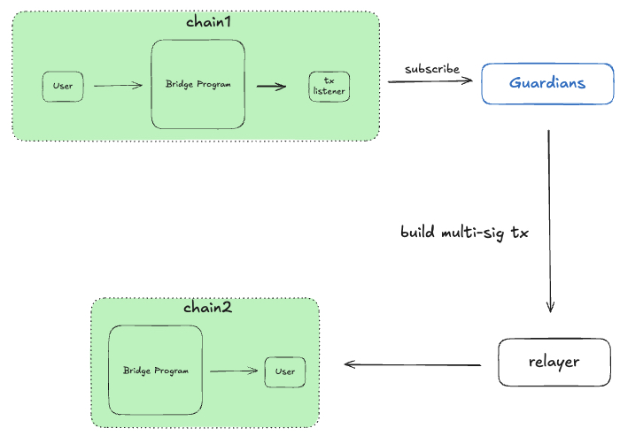
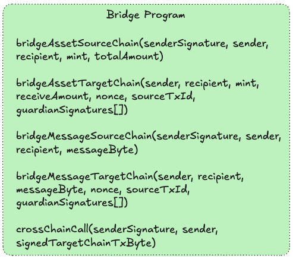
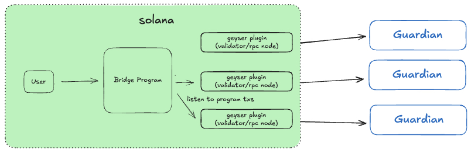
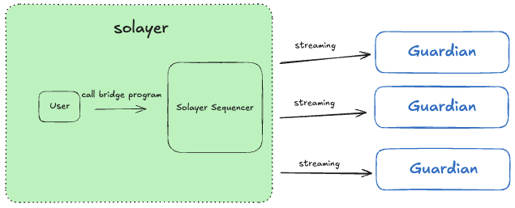
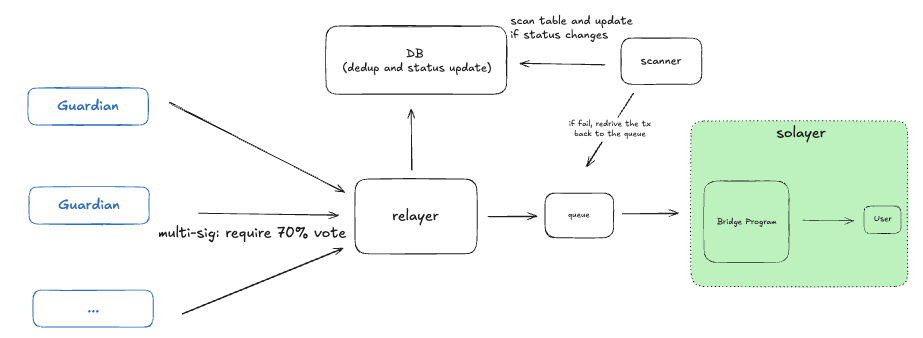

# Bridge Program

https://explorer.solana.com/address/6kpxYKjqe8z66hnDHbbjhEUxha46cnz2UqrneGECmFBg?cluster=devnet
https://explorer.solayer.org/address/6kpxYKjqe8z66hnDHbbjhEUxha46cnz2UqrneGECmFBg

# IDL

check bridge_program_idl.json file

# Test Flow in Solana Devnet

- change BRIDGE_HANDLER_SOLANA_NONCE and BRIDGE_HANDLER_SOLAYER_NONCE as needed in scripts/constants.ts, this will generate new bridge handler instance
- solana-keygen new -f -o ./keys/devnet/fee_vault.json
- yarn ts-node ./scripts/devnet/solana/initialize.ts
- yarn ts-node ./scripts/devnet/solayer/initialize.ts
- yarn ts-node ./scripts/devnet/solana/add_guardian.ts
- yarn ts-node ./scripts/devnet/solayer/add_guardian.ts
- yarn ts-node ./scripts/devnet/solana/update_guardian_threshold.ts
- yarn ts-node ./scripts/devnet/solayer/update_guardian_threshold.ts
- yarn ts-node ./scripts/devnet/solana/bridge_asset_source_chain.ts
- go to solscan and find the output nonce and txId of the bridge_asset_source_chain call
- go to scripts/devnet/solayer/verify_signature.ts, change NONCE and SOURCE_TX_ID with the new value
- yarn ts-node ./scripts/devnet/solayer/verify_signature.ts
- yarn ts-node ./scripts/devnet/solayer/bridge_asset_target_chain.ts
- if the above step returns error with InsufficientFunds, then it means the brdige program on target chain has no token, you need to mint some token to bridge program token vault. You can go to ./scripts/devnet/solayer/add_token_solayer.ts, comment out sendAndConfirmTransaction and uncomment out mintTo, run it
- yarn ts-node ./scripts/devnet/solayer/bridge_asset_target_chain.ts

# Background

We want a bridge to bridge asset/message/cross-chain program calls bidirectionally between solayer and solana. The bridge should be fast and robust. We will break the system down to solana -> solayer and then solayer -> solana.

Full diagram
https://excalidraw.com/#room=02656b0091f0ed27dc12,G9F-Yp3i0En9EQsww-fwDw

# Tenets
- Asset security first
- Fast deposit and withdraw
- Flexibility over future extension

# Overall Architecture

The following diagram explains the overall architecture. On chain1, the user calls the bridge program to bridge assets/message/programCall. Transactions of the bridge program are subscribed by the tx listener and forwarded to guardians/validators. After validating the transactions, guardians build a multi-sig transaction and broadcast to chain2 through relayer, which then calls bridge program on chain2 and finishes the bridge.



# Bridge Program



bridgeAssetSourceChain
1. Divide token into fee and transfer amount. Fee amount will be transferred to bridge handler fee vault and transfer amount will be sent and locked at bridge handler main vault
2. Bridge program will assign an auto incremental nonce to the request, which is used to distinguish between two identical bridge requests
3. A PDA will be created per bridge call, which is used as a proof to for guardian to verify the bridge call indeed happened by checking account db rather than simply trusting transaction ledger.

bridgeAssetTargetChain
1. bridgeAssetSourceChain tx and PDA would be parsed and validated by guardians, then guardian would sign the hash of (sender, recipient, mint, receiveAmount, nonce, and sourceTxId). Signatures will be cached at relayer, and sent on-chain by calling verifySignatures of bridge program once reached the threshold.
2. After enough signatures are verified on chain, relayer then call bridgeAssetTargetChain method.
3. Bridge program generates a PDA with seed of (sender, recipient, mint, receiveAmount, nonce, sourceTxId) and store sourceTxId inside as a proof of bridge execution
4. If the PDA already exists, then tx reverts
5. Otherwise, bridge program transfers the recipient specified amount of tokens

bridgeMessageSourceChain
1. Bridge program assigns an auto incremental nonce to the request
bridgeMessageSourceChain
1. bridgeMessageSourceChain tx would be parsed and validated by guardians, with a tx built to invoke bridgeMessageTargetChain with an array of guardian signatures
2. A PDA will be created per bridge call, which is used as a proof to for guardian to verify the bridge call indeed happened by checking account db rather than simply trusting transaction ledger.

bridgeMessageTargetChain
1. bridgeMessageSourceChain tx and PDA would be parsed and validated by guardians, then guardian would sign the hash of (sender, recipient, bridged_message, nonce, and sourceTxId). Signatures will be cached at relayer, and sent on-chain by calling verifySignatures of bridge program once reached the threshold.
2. After enough signatures are verified on chain, relayer then call bridgeAssetTargetChain method.
3. Similarly, if the PDA already exists, then tx reverts
4. Nothing else would happen as its a message bridge

crossChainCallSourceChain
1. Sender would construct a targetChainTx, sign ahead of time, and serialize into base58 format.
2. Sender will need to pay sol to bridge program for the service

crossChainCallTargetChain
1. After guardian validates and sign, relayer would deserialize and broadcast the signedTargetChainTx on target chain directly and then invoking bridge program to generate the bridge proof with (sender, call_data, nonce, sourceTxId). Target chain txId will also be stored in the bridge proof for reference.

bridgeProof
1. The proof is a PDA generated with the seed of hash of bridge infos like sender, recipient, source_tx_id, mint, call_data, etc.
2. Inside the PDA, it stores the hash, tx_id, and bump

# Transaction Subscription

For solana, we can collect bridge program transactions through the helius transaction subscription service or geyser plugin, with each guardian owning separate tx subscription flow for fault tolerance and better isolation.



For solayer, we can use the transaction streaming feature of sequencer.



# Guardian Workflow

Guardian workers keep fetching records from the queue and execute the following algorithm:

```
for tx in queue:
   if !isValid(tx) or tx_status == "failed" or tx_status == "not found":
       continue
   if tx_status == "finalized":
       return sign(hash(tx_info))
   else if tx_amount < threshold_amount:
       return sign(hash(tx_info))
   else:
       put_tx_back_to_queue(tx)
       continue
```
After validating the tx, the guardian will sign the hash of tx info including sender, recipient, nonce, mint/amount/bridged_message/calldata, txId and send it to the relayer. When DB grows too large, we can purge DB records and calculate the largest handled nonce number and ask the guardian to directly reject records with nonce lower than the number.

To make sure enough decentralization and security, wormhole adopts 19 guardians with 13 as the threshold, layerzero allows you to customize the threshold and number of total decentralized verifier networks (DVNs), and hyperliquid use their L1 validators as the votes and enforce over ⅔ staking power signatures.

For our case, we can start with 7 guardians with 4 as the threshold.

# Multi-Sig Aggregation and Execution



Guardians would sign and send tx info to the relayer. After collecting enough guardians have signed the mul-sig tx, the relayer then collects all multi-sig signatures and constructs a tx to call the bridge program on the target chain.

For crossChainCall, the relayer would decode the input, verify the decoded transaction, and then broadcast it out as a normal tx.

For bridgeAsset/bridgeMessage, the bridge program will validate guardian signatures and execute it only if the pre-set threshold is satisfied. For bridgeAsset, the bridge program will then transfer the asset to users. For bridgeMessage, nothing would happen, the transaction will simply return and succeed.

Relayer has another separated scanner that keeps scanning the database and redrive failed transactions back to the queue.


# Bridged Assets
For tokens we don’t have the mint info, we will need to create wrapped tokens on the solayer chain. We can create any custom mint and use it as an official bridged token. After creating the mint, we should transfer the mint authority to a multi-sig and only send tokens to the bridge program vault as needed.

We do have the mint for sUSD and sSOL so those two tokens can have the same mint address as mainnet.

For bridged assets, we can create a mint on Solayer chain with and hold the authority with squads and then transfer tokens time-to-time to the bridge program on Solayer.

# Finality Analysis

There are two finality points here: 1) finality of source chain tx, 2) finality of target chain tx

For source chain tx, we will implement an insurance-based fast confirmation. If the asset value is less than X dollar amount, then the guardian would take the risk and process the tx right away unless it shows failed status. Otherwise, the tx would be put back to the queue and wait to be handled again until the status becomes “finalized”.

For target chain tx, once the tx is sent out, the relayer would update the status in DB. There would be another scanner to scan the status of all those “handled” tx to detect any anomalies and properly retry if the tx later failed.

# Double-Handling Prevention

We implemented a two-stage caching mechanism to prevent double-handling. Firstly, we store handled transaction info into the database of each guardian. Besides, we also generate PDA on the target chain for each handled bridge call.

However, from time to time, we need to either clear database data as it grows or re-claim rent back from PDAs. The data cleaning or PDA revoke would cause state loss such that the cleaned bridge call could be replayed.

To solve the aforementioned problem, we store a “largest handled nonce” before cleaning database data or revoking PDAs. When users call the bridge program, transactions will be assigned with an auto incremental nonce number. The largest handled nonce number means that all transactions with nonce numbers smaller than this number have been properly handled with finalized status. The largest handled nonce number will be stored into the bridge program and guardians at the time of cleaning the database or revoking PDAs.

# Reference

Layerzero: https://layerzero.network/publications/LayerZero_Whitepaper_V2.1.0.pdf

Wormhole: https://wormhole.com/docs/learn/infrastructure/core-contracts/

Hyperliquid: https://github.com/hyperliquid-dex/contracts/blob/master/Bridge2.sol#L722

Hyperlane: https://docs.hyperlane.xyz/docs/protocol/agents/validators
